# Apache Kafka

**Kafka introduction**
----

- Created by **LinkedIn**, now **Open Source** Project maintained by **Confluent**
- **Distributed**, **resilent** architecture, **fault tolerant**
- **Horizontal scalability**:
	- Can scale to **100s** of **brokers**
	- Can scale to **1M messages per second**
- **High performance** (latency of less that 10 ms) - **real time**
- Used by **2000+firms**, 35% of the Fortune 500.
 
**What's for?**:

- **Messaging system**
- **Activity tracking**
- **Gather metrics** from many locations
- Application **Logs gathering**
- **Stream processing** (with Kafka `Streams Api` or `Spark` for example)
- **Decoupling** of data streams and system
- **Intregration** with `Spark`, `Flink`, `Storm`, `Hadoop`, and many other `Big Data` technologies


# Topics, Partitions and offsets

**Topics**
----

- `Topics`: a particular **stream of data**
	- Similar to a `table` in a `database` (without all **constraints**) 
	- You can have as **many** as topics
	- A **topic** is identified by its **name**
- `Topics` are split into `partitions`
	- Each `partition` is **ordered**
	- Each **message** within a `partition` gets an incremental `id`, called `offset`
	- No **ordering** across `partitions`
	


- `Offset` only have a meaning for a **specific** `partition`: e.g. `offset 3` in `partition 0` **doesn't represent** the same **data** as `offset 3` in `partition 1`
- **order** is **guaranteed** only within a `partition` and not **across partitions**
- **Data** is kept only for a **limited time** (one week by default)
- Once the **data** is **written** into a `partition`, it **CANNOT be changed** (immutability)
- **Data** is assigned **randomly** to a `partition` unless a key is provided

**Brokers**
----
- A **kafka** clusters composed of **multiple brokers** (**servers**)
- Each broker is **identified** with its `ID` (**integer**)
- After **connecting to any broker** (called a **boostrap broker**), you will be **connected** to the **entire cluster**
- a **good number** to get started is **3 brokers**, but some big clusters have over a **100 brokers**
- In these examples we choose to number brokers starting at 100 (arbitrary)
- Example of `topic-A` with 3 partitions
- Example of `topic-B` with 3 partitions


**Topic replication factor**
----
- **Topics** should have a **replication factor**> 1 (usually > = 3)
- This way if a broker is **down**, another **broker** can **serve the data**
- Example: `Topic-A` with `2 partitions` and **replication** `factor of 2`


> if we **lost** `broker 102`, either `broker 101` or `broker 103` can still **serve the data**.


**Partition Leader**
----
- Only once **broker** can be **leader** for a `partition` at any given time
- Only that **leader** can **receive and serve** the `data` for a `partition`
- The **other brokers** will **synchronize** the `data`
- As a result, each `partition` has one and only one **leader at any given moment** and **multiple ISR** (In-Sync Replica's) 


**Producers**
----
- **Producers** `write` data into `topics` (which made of `partitions`)
- **Producers** automatically **know** to which **broker** and `partition` to **write to**
- In case of **broker failures**, **producers** will automatically **recover**
- **Producers** can choose **acknowledgement** of **data writes in 3 ways**: 
	- `acks=0` : `producer` won't wait for **acknowledgement**
	- `acks=1` : `producer` will wait for the **leader acknowledgement** (*limited data loss*)
	- `acks=all` :`producer` will wait for the **leader & replicas acknowledgement**  (*no data loss*)
	


- **Producers** can choose to send a **key** with the `message`(`string`, `number`, ect ...)
- If `key=null`, data is sent in `round robin` manner (`broker 101`, `broker 102` , ...)
- If a **key** is sent, then all **messages** for that `key` will always go to the **same** `partition`
- A `key` is basically **sent** if you **need message ordering** for a **specific fields**
		- e.g. *truck_id*
		


**Consumers**
----	
- **Consumers**	**read data** from a `topic` (identified by `name`)
- **Consumers**	know which `broker` to **read from**
- In case of **broker failures**, **consumers** know how to **recover**
	
	
	
	
	
**Consumer Group**
----	

- **Consumers**	**read data** in consumer **groups**	
- Each **consumer** within a **group** reads from an **exclusive partitions**
	


- If we have **more consumers** than `partitions`, some **consumers** will be `inactive`
 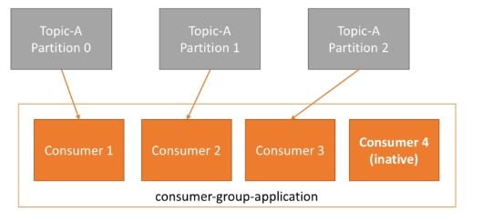	
 
 
 
 	
**Consumer Offsets**
----	

- `Kafka` stores the `offsets` at which a **consumer group** has been reading
- The `offsets` committed live in a Kafka `topic` named `__consumer_offsets`
- When a `consumer` in a `group` has **processed data** received from `kafka`, **_it should commit the offsets!_**
- If a `consumer` **dies**, it will be able to **read back** from where it **left off** thanks to the **committed consumer** `offsets`!
 	
 
 	
**Delivery semantics for consumers**
----	

**Consumers** choose when to **commit** `offsets` , there is three delivery semantics :

- **At most once**
	- **offsets** are committed as soon as the message is received.
	- If the processing goes wrong, the message will be **lost** (it won't be read again)
- **At least once** (default) :
	- `offsets` are **committed** after the **message** is **processed**.
	- If the message **processing** goes wrong, the `message` will be **read again**.
	- This can result in **duplicate messages processing** if the processing is not `idempotent`.
- **Exactly once**:
	- Can be **achieved** for **Kafka** => **Kafka workflow** using `Kafka Streams Api`
	- For **Kafka** => **External System workflows**, use an `idempotent consumer`.
	
	> `idempotent` : means processing the messages again won't have any impact on the systems.
	
> **At least once** : i.e. at restart we will read the message again in case of abnormal shutdown, so we will read the message for sure at least once (we don't know if we read the message before the program stops).	
**Kafka Broker Discovery**
----	
- Every **Kafka broker** is also called a `bootstrap server`.
- Since each `broker` already **knows** about all **others brokers**, `topics` and `partitions` (`metadata`), this means that we need to **connect** only to **one broker** and then we will be **connected** to the entire **cluster**.
	
 
 
 
**Zookeeper**
----	
- **Manages all brokers** (keep a list of them)
- performs **leader elections** for `partitions`
- **send notifications** to `Kafka` in case of **changes** (e.g. new topic, broker dies, broker comes up, delete topic, etc,...)
- `Kafka` **CANNOT work without Zookeeper**
- It **operates** by design with an **odd number** (3,5,7)
- It has a **leader** that handles `writes`, and **followers** (i.e. rest of the servers) that handles `reads` only.
- **Zookeeper does NOT store** `consumer offset` anymore since `Kafka V0.10+`
  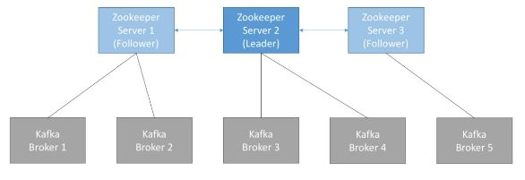
 
**Kafka Guarantees**
----	
- **Messages** are appended to a `topic-partition` in the order they are sent.
- **Consumers** read messages in the **order stored** in a **topic-partition**.
- With a **replication factor of N**, `producers` and `consumers` can tolerate up to `N-1 brokers` being **down**.
- This is why a **replication of 3 seems wise**:
	- Allows for **one broker** to be **taken down** for **maintenance**.
	- Allows for **another broker** to be **taken down unexpectedly**.	
- As long as the **number of partitions** remains **constant** for a `topic` (**no new partitions**), the same `key` will always go to the **same** `partition`.

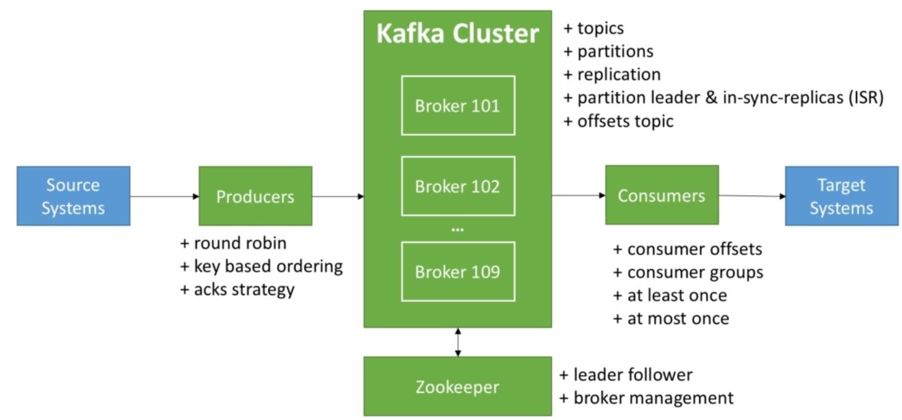


# Ubuntu 18.4 Insallation 

1 - ` wget https://downloads.apache.org/kafka/2.6.0/kafka_2.13-2.6.0.tgz`.

2 - `tar xzf kafka_2.13-2.6.0.tgz  -C /opt/`.

3 - ` dev@slave-node:/opt/kafka_2.13-2.6.0$ mkdir data`.

4 - ` dev@slave-node:/opt/kafka_2.13-2.6.0$ mkdir data/zookeeper`.

5 - ` vim config/zookeeper.properties `  & **change** `dataDir=/opt/kafka_2.13-2.6.0/data/zookeeper` and **save**.

6 - start zookeeper ` dev@slave-node:/opt/kafka_2.13-2.6.0$ zookeeper-server-start.sh  config/zookeeper.properties`. or `dev@slave-node:~$ zookeeper-server-start.sh  /opt/kafka_2.13-2.6.0/config/zookeeper.properties`.

7 - check if version-2 is created .
```sh
dev@slave-node:/opt/kafka_2.13-2.6.0$ ls data/zookeeper/
version-2
```
8- Create **kafka folder** which holds **metadata** : `mkdir /opt/kafka_2.13-2.6.0/data/kafka`

9- change `log.dirs` in `server.properties` file : `vim /opt/kafka_2.13-2.6.0/config/server.properties` and then `log.dirs=/opt/kafka_2.13-2.6.0/data/kafka` , and **save**

10- start kafka servers : `kafka-server-start.sh /opt/kafka_2.13-2.6.0/config/server.properties`

11- [install kafka tool](https://www.kafkatool.com/download.html) and connect to `localhost:2181`


# Windows 10 Insallation 

1- [GET KAFKA](https://www.apache.org/dyn/closer.cgi?path=/kafka/2.6.0/kafka_2.13-2.6.0.tgz),    [see quick start](https://kafka.apache.org/quickstart)

2- use the winrar  and put the folder [kafka_x.xx-x.x.x] in a `c:\` drive

3- Add the  `c:\[kafka_x.xx-x.x.x]\bin\windows` to the Path environment variable

4- Java 8 is required : Install it if not done yet. 

5- inside  `c:\[kafka_x.xx-x.x.x]\` Create folder `data\logs` `data\zooKeeper`.

6- Change the `dataDir=C:\\[kafka_x.xx-x.x.x]\\data\\zookeeper` inside `C:\[kafka_x.xx-x.x.x]\config\zookeeper.properties` 

7- Change the `log.dirs=C:\\[kafka_x.xx-x.x.x]\\data\\logs` inside `C:\[kafka_x.xx-x.x.x]\config\server.properties` 

8- Start the ZooKeeper service : `zookeeper-server-start.bat C:\[kafka_x.xx-x.x.x]\config\zookeeper.properties`

9- Start the Kafka broker service : `kafka-server-start.bat C:\[kafka_x.xx-x.x.x]\config\server.properties`

> Soon, ZooKeeper will no longer be required by Apache Kafka.


**Kafka Console Producer CLI**
----

- `kafka-console-producer.bat --broker-list 127.0.0.1:9092 --topic first_topic`
```
>hello there
```
- `kafka-console-producer.bat --broker-list 127.0.0.1:9092 --topic first_topic --producer-property acks=all`
```
>hi again how are
>I thought you were sleeping
```
> `acks=all` the producer has to wait for **acknowledgment** from both the **leader** and **In-Sync/replicas partition** (zero loss data)

- `kafka-console-producer.bat --broker-list 127.0.0.1:9092 --topic new_topic` : new_topic doesn't exist yet!
```
>hi there new_topic
[2020-09-21 18:12:15,897] WARN [Producer clientId=console-producer] Error while fetching metadata with correlation id 3 : {new_topic=LEADER_NOT_AVAILABLE} (org.apache.kafka.clients.NetworkClient)
>another message
>
```

> If we go to broker console `[2020-09-21 18:12:15,894] INFO [KafkaApi-0] Auto creation of topic new_topic with 1 partitions and replication factor 1 is successful (kafka.server.KafkaApis)` : `new_topic` was created but the leader election for the partition is not happened yet! that why we get the exception/WARN `{new_topic=LEADER_NOT_AVAILABLE}`. The producer is able to recover from errors, i.e. the producer was able to produce the message afterward (e.g. we still get `hi there new_topic` to the partition). 


**all kafka-console-producer.bat arguments**

```ssh
Missing required option(s) [bootstrap-server]
Option                                   Description
------                                   -----------
--batch-size <Integer: size>             Number of messages to send in a single
                                           batch if they are not being sent
                                           synchronously. (default: 200)
--bootstrap-server <String: server to    REQUIRED unless --broker-list
  connect to>                              (deprecated) is specified. The server
                                           (s) to connect to. The broker list
                                           string in the form HOST1:PORT1,HOST2:
                                           PORT2.
--broker-list <String: broker-list>      DEPRECATED, use --bootstrap-server
                                           instead; ignored if --bootstrap-
                                           server is specified.  The broker
                                           list string in the form HOST1:PORT1,
                                           HOST2:PORT2.
--compression-codec [String:             The compression codec: either 'none',
  compression-codec]                       'gzip', 'snappy', 'lz4', or 'zstd'.
                                           If specified without value, then it
                                           defaults to 'gzip'
--help                                   Print usage information.
--line-reader <String: reader_class>     The class name of the class to use for
                                           reading lines from standard in. By
                                           default each line is read as a
                                           separate message. (default: kafka.
                                           tools.
                                           ConsoleProducer$LineMessageReader)
--max-block-ms <Long: max block on       The max time that the producer will
  send>                                    block for during a send request
                                           (default: 60000)
--max-memory-bytes <Long: total memory   The total memory used by the producer
  in bytes>                                to buffer records waiting to be sent
                                           to the server. (default: 33554432)
--max-partition-memory-bytes <Long:      The buffer size allocated for a
  memory in bytes per partition>           partition. When records are received
                                           which are smaller than this size the
                                           producer will attempt to
                                           optimistically group them together
                                           until this size is reached.
                                           (default: 16384)
--message-send-max-retries <Integer>     Brokers can fail receiving the message
                                           for multiple reasons, and being
                                           unavailable transiently is just one
                                           of them. This property specifies the
                                           number of retires before the
                                           producer give up and drop this
                                           message. (default: 3)
--metadata-expiry-ms <Long: metadata     The period of time in milliseconds
  expiration interval>                     after which we force a refresh of
                                           metadata even if we haven't seen any
                                           leadership changes. (default: 300000)
--producer-property <String:             A mechanism to pass user-defined
  producer_prop>                           properties in the form key=value to
                                           the producer.
--producer.config <String: config file>  Producer config properties file. Note
                                           that [producer-property] takes
                                           precedence over this config.
--property <String: prop>                A mechanism to pass user-defined
                                           properties in the form key=value to
                                           the message reader. This allows
                                           custom configuration for a user-
                                           defined message reader. Default
                                           properties include:
        parse.
                                           key=true|false
        key.separator=<key.
                                           separator>
        ignore.error=true|false
--request-required-acks <String:         The required acks of the producer
  request required acks>                   requests (default: 1)
--request-timeout-ms <Integer: request   The ack timeout of the producer
  timeout ms>                              requests. Value must be non-negative
                                           and non-zero (default: 1500)
--retry-backoff-ms <Integer>             Before each retry, the producer
                                           refreshes the metadata of relevant
                                           topics. Since leader election takes
                                           a bit of time, this property
                                           specifies the amount of time that
                                           the producer waits before refreshing
                                           the metadata. (default: 100)
--socket-buffer-size <Integer: size>     The size of the tcp RECV size.
                                           (default: 102400)
--sync                                   If set message send requests to the
                                           brokers are synchronously, one at a
                                           time as they arrive.
--timeout <Integer: timeout_ms>          If set and the producer is running in
                                           asynchronous mode, this gives the
                                           maximum amount of time a message
                                           will queue awaiting sufficient batch
                                           size. The value is given in ms.
                                           (default: 1000)
--topic <String: topic>                  REQUIRED: The topic id to produce
                                           messages to.
--version                                Display Kafka version.
```

**get the list of topics through zookeeper**


```ssh
kafka-topics --zookeeper 127.0.0.1:2181 --list
#output
first_topic
new_topic
second_topic
```

```ssh
kafka-topics --zookeeper 127.0.0.1:2181 --topic new_topic --describe
#output : new_topic has one partition (partition 0) and one replication factor
Topic: new_topic        PartitionCount: 1       ReplicationFactor: 1    Configs:
        Topic: new_topic        Partition: 0    Leader: 0       Replicas: 0     Isr: 0
```
**Changing the config new topic to have 3 partitions by default**
- Go to `C:\[kafka_x.xx-x.x.x]\config\server.properties`  and update `num.partitions=3`
- Stop the broker and start it: `kafka-server-start.sh /opt/kafka_2.13-2.6.0/config/server.properties`

```ssh
kafka-console-producer.bat --broker-list 127.0.0.1:9092 --topic third_topic --producer-property acks=all
>hi there (WARN)
[2020-09-21 21:17:10,647] WARN [Producer clientId=console-producer] Error while fetching metadata with correlation id 3 : {third_topic=LEADER_NOT_AVAILABLE} (org.apache.kafka.clients.NetworkClient)
>Terminate batch job (Y/N)? y


kafka-topics --zookeeper 127.0.0.1:2181 --list
#output
first_topic
new_topic
second_topic
third_topic


kafka-topics --zookeeper 127.0.0.1:2181 --topic third_topic --describe
Topic: third_topic      PartitionCount: 3       ReplicationFactor: 1    Configs:
        Topic: third_topic      Partition: 0    Leader: 0       Replicas: 0     Isr: 0
        Topic: third_topic      Partition: 1    Leader: 0       Replicas: 0     Isr: 0
        Topic: third_topic      Partition: 2    Leader: 0       Replicas: 0     Isr: 0
```

> **Best practices**: create topics before using them. 


**Kafka Console Consumer CLI**
----
The **consumer** intercepts only `new messages` and doesn't read all `topics` **messages** (i.e. not the one that occurs before), this a `default` **behaviour**.

```ssh
kafka-console-consumer.bat --bootstrap-server 127.0.0.1:9092 --topic  third_topic
# output zero messages
```


**start consumer first and wait**
```ssh
kafka-console-consumer.bat --bootstrap-server 127.0.0.1:9092 --topic  third_topic
# output: received new producer messages
hi there
another message
get that one as well
yes
no
```


**start producer in a new console and type messages to be sent to third_topic**
```ssh
kafka-console-producer.bat --broker-list 127.0.0.1:9092 --topic third_topic --producer-property acks=all
# messages to be sent to third_topic
>hi there
>another message
>get that one as well
>yes
>no
>
```

> we will see messages appears on the consumer console


### Case : Consumer can see messages from the beginning

**Consumer** receives all **producer messages** since the **beginning** and also the **new ones**.

```ssh
kafka-console-consumer.bat --bootstrap-server 127.0.0.1:9092 --topic  third_topic --from-beginning  
# output: received all producer messages since the beginning and also the new ones
hi there (WARN)
get that one as well
no
hi there
yes
another message
```


####  All available option for kafka-console-consumer.bat
```ssh
kafka-console-consumer.bat

This tool helps to read data from Kafka topics and outputs it to standard output.
Option                                   Description
------                                   -----------
--bootstrap-server <String: server to    REQUIRED: The server(s) to connect to.
  connect to>
--consumer-property <String:             A mechanism to pass user-defined
  consumer_prop>                           properties in the form key=value to
                                           the consumer.
--consumer.config <String: config file>  Consumer config properties file. Note
                                           that [consumer-property] takes
                                           precedence over this config.
--enable-systest-events                  Log lifecycle events of the consumer
                                           in addition to logging consumed
                                           messages. (This is specific for
                                           system tests.)
--formatter <String: class>              The name of a class to use for
                                           formatting kafka messages for
                                           display. (default: kafka.tools.
                                           DefaultMessageFormatter)
--from-beginning                         If the consumer does not already have
                                           an established offset to consume
                                           from, start with the earliest
                                           message present in the log rather
                                           than the latest message.
--group <String: consumer group id>      The consumer group id of the consumer.
--help                                   Print usage information.
--isolation-level <String>               Set to read_committed in order to
                                           filter out transactional messages
                                           which are not committed. Set to
                                           read_uncommitted to read all
                                           messages. (default: read_uncommitted)
--key-deserializer <String:
  deserializer for key>
--max-messages <Integer: num_messages>   The maximum number of messages to
                                           consume before exiting. If not set,
                                           consumption is continual.
--offset <String: consume offset>        The offset id to consume from (a non-
                                           negative number), or 'earliest'
                                           which means from beginning, or
                                           'latest' which means from end
                                           (default: latest)
--partition <Integer: partition>         The partition to consume from.
                                           Consumption starts from the end of
                                           the partition unless '--offset' is
                                           specified.
--property <String: prop>                The properties to initialize the
                                           message formatter. Default
                                           properties include:
        print.
                                           timestamp=true|false
        print.
                                           key=true|false
        print.
                                           value=true|false
        key.separator=<key.
                                           separator>
        line.separator=<line.
                                           separator>
        key.deserializer=<key.
                                           deserializer>
        value.
                                           deserializer=<value.deserializer>
                                           Users can also pass in customized
                                           properties for their formatter; more
                                           specifically, users can pass in
                                           properties keyed with 'key.
                                           deserializer.' and 'value.
                                           deserializer.' prefixes to configure
                                           their deserializers.
--skip-message-on-error                  If there is an error when processing a
                                           message, skip it instead of halt.
--timeout-ms <Integer: timeout_ms>       If specified, exit if no message is
                                           available for consumption for the
                                           specified interval.
--topic <String: topic>                  The topic id to consume on.
--value-deserializer <String:
  deserializer for values>
--version                                Display Kafka version.
--whitelist <String: whitelist>          Regular expression specifying
                                           whitelist of topics to include for
                                           consumption.
```

### Case : Consumers in group mode

by **default** we can see only **new messages**.

**start 'my-first-app-group' consumer group first and wait**
```ssh
kafka-console-consumer.bat --bootstrap-server 127.0.0.1:9092 --topic  third_topic --group my-first-app-group
# output: received new producer messages
hello group
did receive that message
?
answer me
hmmm


```

**start producer in a new console and type messages to be sent to third_topic**

```ssh
kafka-console-producer.bat --broker-list 127.0.0.1:9092 --topic third_topic --producer-property acks=all
# messages to be sent to third_topic
>hello group
>did receive that message
>?
>answer me
>hmmm
>
```

####  Load balancing between consumer group

*here we create three consumers group 'my-first-app-group'*. We have **three partitions** and each **consumer** group read from an **exclusive** **partition**!

**start 'my-first-app-group' consumer first in new console and wait**
```ssh
kafka-console-consumer.bat --bootstrap-server 127.0.0.1:9092 --topic  third_topic --group my-first-app-group
# output: received new producer messages
3
4
8
9
12
19
```

**start 'my-first-app-group' consumer group in another new console and wait**
```ssh
kafka-console-consumer.bat --bootstrap-server 127.0.0.1:9092 --topic  third_topic --group my-first-app-group
# output: received new producer messages
5
6
13
14
17
18
```

**start 'my-first-app-group' consumer group in another new console and wait**
```ssh
kafka-console-consumer.bat --bootstrap-server 127.0.0.1:9092 --topic  third_topic --group my-first-app-group
# output: received new producer messages
1
2
7
10
11
15
16
20
```

**start producer in a new console and type messages to be sent to third_topic**

```ssh
kafka-console-producer.bat --broker-list 127.0.0.1:9092 --topic third_topic --producer-property acks=all
# messages to be sent to third_topic
>1
>2
>3
>4
>5
>6
>7
>8
>9
>10
>11
>12
>13
>14
>15
>16
>17
>18
>19
>20
>
```

If a **consumer group** is **withdrawn** then the **messages** get **rebalanced** between the two remaining **partitions**.


#### Groups and offset

if we **run** `kafka-console-consumer.bat --bootstrap-server 127.0.0.1:9092 --topic  third_topic --group my-second-app-group --from-beginning`.
we will **read all messages** from the **beginning**, but if we **re-run** it we will read **zero messages**, because the **offset** is been **committed** to last **read position**. only **new messages** get **read** (i.e. `--from-beginning` has no effect in the 2nd time).

if we **stop the consumer group** and **keep sending** the **producer messages** and then **run** the `kafka-console-consumer.bat --bootstrap-server 127.0.0.1:9092 --topic  third_topic --group my-second-app-group` we will see **all new messages**.


####  All available option for kafka-consumer-groups.bat


```ssh
Option                                  Description
------                                  -----------
--all-groups                            Apply to all consumer groups.
--all-topics                            Consider all topics assigned to a
                                          group in the `reset-offsets` process.
--bootstrap-server <String: server to   REQUIRED: The server(s) to connect to.
  connect to>
--by-duration <String: duration>        Reset offsets to offset by duration
                                          from current timestamp. Format:
                                          'PnDTnHnMnS'
--command-config <String: command       Property file containing configs to be
  config property file>                   passed to Admin Client and Consumer.
--delete                                Pass in groups to delete topic
                                          partition offsets and ownership
                                          information over the entire consumer
                                          group. For instance --group g1 --
                                          group g2
--delete-offsets                        Delete offsets of consumer group.
                                          Supports one consumer group at the
                                          time, and multiple topics.
--describe                              Describe consumer group and list
                                          offset lag (number of messages not
                                          yet processed) related to given
                                          group.
--dry-run                               Only show results without executing
                                          changes on Consumer Groups.
                                          Supported operations: reset-offsets.
--execute                               Execute operation. Supported
                                          operations: reset-offsets.
--export                                Export operation execution to a CSV
                                          file. Supported operations: reset-
                                          offsets.
--from-file <String: path to CSV file>  Reset offsets to values defined in CSV
                                          file.
--group <String: consumer group>        The consumer group we wish to act on.
--help                                  Print usage information.
--list                                  List all consumer groups.
--members                               Describe members of the group. This
                                          option may be used with '--describe'
                                          and '--bootstrap-server' options
                                          only.
                                        Example: --bootstrap-server localhost:
                                          9092 --describe --group group1 --
                                          members
--offsets                               Describe the group and list all topic
                                          partitions in the group along with
                                          their offset lag. This is the
                                          default sub-action of and may be
                                          used with '--describe' and '--
                                          bootstrap-server' options only.
                                        Example: --bootstrap-server localhost:
                                          9092 --describe --group group1 --
                                          offsets
--reset-offsets                         Reset offsets of consumer group.
                                          Supports one consumer group at the
                                          time, and instances should be
                                          inactive
                                        Has 2 execution options: --dry-run
                                          (the default) to plan which offsets
                                          to reset, and --execute to update
                                          the offsets. Additionally, the --
                                          export option is used to export the
                                          results to a CSV format.
                                        You must choose one of the following
                                          reset specifications: --to-datetime,
                                          --by-period, --to-earliest, --to-
                                          latest, --shift-by, --from-file, --
                                          to-current.
                                        To define the scope use --all-topics
                                          or --topic. One scope must be
                                          specified unless you use '--from-
                                          file'.
--shift-by <Long: number-of-offsets>    Reset offsets shifting current offset
                                          by 'n', where 'n' can be positive or
                                          negative.
--state [String]                        When specified with '--describe',
                                          includes the state of the group.
                                        Example: --bootstrap-server localhost:
                                          9092 --describe --group group1 --
                                          state
                                        When specified with '--list', it
                                          displays the state of all groups. It
                                          can also be used to list groups with
                                          specific states.
                                        Example: --bootstrap-server localhost:
                                          9092 --list --state stable,empty
                                        This option may be used with '--
                                          describe', '--list' and '--bootstrap-
                                          server' options only.
--timeout <Long: timeout (ms)>          The timeout that can be set for some
                                          use cases. For example, it can be
                                          used when describing the group to
                                          specify the maximum amount of time
                                          in milliseconds to wait before the
                                          group stabilizes (when the group is
                                          just created, or is going through
                                          some changes). (default: 5000)
--to-current                            Reset offsets to current offset.
--to-datetime <String: datetime>        Reset offsets to offset from datetime.
                                          Format: 'YYYY-MM-DDTHH:mm:SS.sss'
--to-earliest                           Reset offsets to earliest offset.
--to-latest                             Reset offsets to latest offset.
--to-offset <Long: offset>              Reset offsets to a specific offset.
--topic <String: topic>                 The topic whose consumer group
                                          information should be deleted or
                                          topic whose should be included in
                                          the reset offset process. In `reset-
                                          offsets` case, partitions can be
                                          specified using this format: `topic1:
                                          0,1,2`, where 0,1,2 are the
                                          partition to be included in the
                                          process. Reset-offsets also supports
                                          multiple topic inputs.
--verbose                               Provide additional information, if
                                          any, when describing the group. This
                                          option may be used with '--
                                          offsets'/'--members'/'--state' and
                                          '--bootstrap-server' options only.
                                        Example: --bootstrap-server localhost:
                                          9092 --describe --group group1 --
                                          members --verbose
--version                               Display Kafka version.

```


**Kafka-consumer-groups CLI**
----

``` ssh
Kafka-consumer-groups --bootstrap-server localhost:9092 --list
#output
my-first-app-group
my-second-app-group
```

``` ssh
Kafka-consumer-groups --bootstrap-server localhost:9092 --describe --group  my-first-app-group
#output
Consumer group 'my-first-app-group' has no active members.

GROUP              TOPIC           PARTITION  CURRENT-OFFSET  LOG-END-OFFSET  LAG             CONSUMER-ID     HOST            CLIENT-ID
my-first-app-group third_topic     2          81              81              0               -               -               -
my-first-app-group third_topic     1          60              63              3               -               -               -
my-first-app-group third_topic     0          78              82              4               -               -               -
```

**note that** :
- **3 partitions** for **TOPIC** `third_topic`: 0,1 & 2
- `CURRENT-OFFSET` is the read position in each partition
- `LOG-END-OFFSET` is last position to read
- `LAG` : how many position are available for read per partition (i.e. **number of catch-up's**)


####  All available option for kafka-consumer-groups.bat
```ssh
List all groups, describe a consumer group delete a consumer group, delete consumer group info, or reset consumer group offsets.
Option                                  Description
------                                  -----------
--all-groups                            Apply to all consumer groups.
--all-topics                            Consider all topics assigned to a
                                          group in the `reset-offsets` process.
--bootstrap-server <String: server to   REQUIRED: The server(s) to connect to.
  connect to>
--by-duration <String: duration>        Reset offsets to offset by duration
                                          from current timestamp. Format:
                                          'PnDTnHnMnS'
--command-config <String: command       Property file containing configs to be
  config property file>                   passed to Admin Client and Consumer.
--delete                                Pass in groups to delete topic
                                          partition offsets and ownership
                                          information over the entire consumer
                                          group. For instance --group g1 --
                                          group g2
--delete-offsets                        Delete offsets of consumer group.
                                          Supports one consumer group at the
                                          time, and multiple topics.
--describe                              Describe consumer group and list
                                          offset lag (number of messages not
                                          yet processed) related to given
                                          group.
--dry-run                               Only show results without executing
                                          changes on Consumer Groups.
                                          Supported operations: reset-offsets.
--execute                               Execute operation. Supported
                                          operations: reset-offsets.
--export                                Export operation execution to a CSV
                                          file. Supported operations: reset-
                                          offsets.
--from-file <String: path to CSV file>  Reset offsets to values defined in CSV
                                          file.
--group <String: consumer group>        The consumer group we wish to act on.
--help                                  Print usage information.
--list                                  List all consumer groups.
--members                               Describe members of the group. This
                                          option may be used with '--describe'
                                          and '--bootstrap-server' options
                                          only.
                                        Example: --bootstrap-server localhost:
                                          9092 --describe --group group1 --
                                          members
--offsets                               Describe the group and list all topic
                                          partitions in the group along with
                                          their offset lag. This is the
                                          default sub-action of and may be
                                          used with '--describe' and '--
                                          bootstrap-server' options only.
                                        Example: --bootstrap-server localhost:
                                          9092 --describe --group group1 --
                                          offsets
--reset-offsets                         Reset offsets of consumer group.
                                          Supports one consumer group at the
                                          time, and instances should be
                                          inactive
                                        Has 2 execution options: --dry-run
                                          (the default) to plan which offsets
                                          to reset, and --execute to update
                                          the offsets. Additionally, the --
                                          export option is used to export the
                                          results to a CSV format.
                                        You must choose one of the following
                                          reset specifications: --to-datetime,
                                          --by-period, --to-earliest, --to-
                                          latest, --shift-by, --from-file, --
                                          to-current.
                                        To define the scope use --all-topics
                                          or --topic. One scope must be
                                          specified unless you use '--from-
                                          file'.
--shift-by <Long: number-of-offsets>    Reset offsets shifting current offset
                                          by 'n', where 'n' can be positive or
                                          negative.
--state [String]                        When specified with '--describe',
                                          includes the state of the group.
                                        Example: --bootstrap-server localhost:
                                          9092 --describe --group group1 --
                                          state
                                        When specified with '--list', it
                                          displays the state of all groups. It
                                          can also be used to list groups with
                                          specific states.
                                        Example: --bootstrap-server localhost:
                                          9092 --list --state stable,empty
                                        This option may be used with '--
                                          describe', '--list' and '--bootstrap-
                                          server' options only.
--timeout <Long: timeout (ms)>          The timeout that can be set for some
                                          use cases. For example, it can be
                                          used when describing the group to
                                          specify the maximum amount of time
                                          in milliseconds to wait before the
                                          group stabilizes (when the group is
                                          just created, or is going through
                                          some changes). (default: 5000)
--to-current                            Reset offsets to current offset.
--to-datetime <String: datetime>        Reset offsets to offset from datetime.
                                          Format: 'YYYY-MM-DDTHH:mm:SS.sss'
--to-earliest                           Reset offsets to earliest offset.
--to-latest                             Reset offsets to latest offset.
--to-offset <Long: offset>              Reset offsets to a specific offset.
--topic <String: topic>                 The topic whose consumer group
                                          information should be deleted or
                                          topic whose should be included in
                                          the reset offset process. In `reset-
                                          offsets` case, partitions can be
                                          specified using this format: `topic1:
                                          0,1,2`, where 0,1,2 are the
                                          partition to be included in the
                                          process. Reset-offsets also supports
                                          multiple topic inputs.
--verbose                               Provide additional information, if
                                          any, when describing the group. This
                                          option may be used with '--
                                          offsets'/'--members'/'--state' and
                                          '--bootstrap-server' options only.
                                        Example: --bootstrap-server localhost:
                                          9092 --describe --group group1 --
                                          members --verbose
--version                               Display Kafka version.
```


**Reset the Offsets**
----
the **purpose** is to make the **consumer group** to **read the data** from any **offset/position**.

the following command **offsets** the **consumer group** `my-first-app-group` to **zero** read position (`--to-earliest`). 

```
Kafka-consumer-groups --bootstrap-server localhost:9092 --group  my-first-app-group --reset-offsets --to-earliest --execute --topic third_topic
#output :
GROUP                          TOPIC                          PARTITION  NEW-OFFSET
my-first-app-group             third_topic                    0          0
my-first-app-group             third_topic                    1          0
my-first-app-group             third_topic                    2          0
```

if we **run** `kafka-console-consumer.bat --bootstrap-server 127.0.0.1:9092 --topic  third_topic --group my-first-app-group` we will **see** all **data all over again**. 

or 
`Kafka-consumer-groups --bootstrap-server localhost:9092 --group  my-first-app-group --reset-offsets --to-offset 0 --execute --topic third_topic`

**Check out the** `LAG`

```
Kafka-consumer-groups --bootstrap-server localhost:9092 --group  my-first-app-group --describe

GROUP               TOPIC           PARTITION  CURRENT-OFFSET  LOG-END-OFFSET  LAG             CONSUMER-ID                                     HOST            CLIENT-ID
my-first-app-group third_topic     0          0              59              59               consumer-1-0a14ad09-db13-4b00-b717-7cf7a669d04c /192.168.0.156  consumer-1
my-first-app-group third_topic     1          0              76              76               consumer-1-0a14ad09-db13-4b00-b717-7cf7a669d04c /192.168.0.156  consumer-1
my-first-app-group third_topic     2          0              10              10               consumer-1-0a14ad09-db13-4b00-b717-7cf7a669d04c /192.168.0.156  consumer-1

```


#### Option : shift-by '-2'

> **backward shift-by 2** on each **partition** (i.e **2x partition numbers**)

> use a **positive number** for a **forward shift-by**.

```
Kafka-consumer-groups --bootstrap-server localhost:9092 --group  my-first-app-group --reset-offsets --shift-by -2 --execute --topic third_topic
#output :
GROUP                          TOPIC                          PARTITION  NEW-OFFSET
my-first-app-group             third_topic                    0          97
my-first-app-group             third_topic                    1          72
my-first-app-group             third_topic                    2          92
```
**note** if we run ` kafka-console-consumer.bat --bootstrap-server 127.0.0.1:9092 --topic  third_topic --group my-first-app-group` we will see the **last 6 messages** (i.e. **backward shift-by 2** on each **partition** : **2x3**) 


# Kafka Java client
----

## Kafka Java Producers
----
Throughout this project, we use the following **maven** dependencies for **Kafka client** and **logging**, **_see pom files_** : [project pom](/Kafka/simple-Java/pom.xml) & [kafka basics module pom](/Kafka/simple-Java/Kafka-Basics/pom.xml).

[Learn more about producer config](https://kafka.apache.org/documentation/#producerconfigs)

```xml
<dependencies>
	<!-- https://mvnrepository.com/artifact/org.apache.kafka/kafka-clients -->
	<dependency>
		<groupId>org.apache.kafka</groupId>
		<artifactId>kafka-clients</artifactId>
		<version>2.0.0</version>
	</dependency>
	<!-- https://mvnrepository.com/artifact/org.slf4j/slf4j-simple -->
	<dependency>
		<groupId>org.slf4j</groupId>
		<artifactId>slf4j-simple</artifactId>
		<version>1.7.25</version>
	</dependency>
</dependencies>
```

**Simple Java producer**
----
1- Create Producer properties
```java
final String bootstrapServers = "127.0.0.1:9092";

Properties properties = new Properties();
properties.setProperty(ProducerConfig.BOOTSTRAP_SERVERS_CONFIG, bootstrapServers);
properties.setProperty(ProducerConfig.KEY_SERIALIZER_CLASS_CONFIG, StringSerializer.class.getName());
properties.setProperty(ProducerConfig.VALUE_SERIALIZER_CLASS_CONFIG, StringSerializer.class.getName());
```

2- create the producer

```java
KafkaProducer<String, String> producer = new KafkaProducer<String, String>(properties);
```
3- create a producer record

```java
ProducerRecord<String, String> record =
         new ProducerRecord<String, String>("first_topic", "hello first topic");
```

4- send data - asynchronous
```java
producer.send(record);
```
5- flush and close producer

```java
// flush data in order to to wait for the data to be sent (send data is asynchronous!)
producer.flush();
// or alternatively: flush and close producer
producer.close();
```
see full [SimpleProducer.java](/Kafka/simple-Java/Kafka-Basics/src/main/java/example/producers/SimpleProducer.java)

**Simple Java producer with callback**
----
The idea here is to understand where the `message` was **produced**, and if it was **produced correctly**, and what's the `offset` **value** and the `partition` **number**.

In previously described *fouth step* , the `send` **method** takes an extra **argument** which is a **callback**. 

```java
producer.send(record, new Callback() {
// on completion, executes every time, a record being successfully sent or an exception is thrown
  public void onCompletion(RecordMetadata recordMetadata, Exception e) {
      if (e == null) {
          // the record was successfully sent
          logger.info("Received new metadata. \n" +
    "Topic:" + recordMetadata.topic() + "\n" +
    "Partition: " + recordMetadata.partition() + "\n" +
    "Offset: " + recordMetadata.offset() + "\n" +
    "Timestamp: " + recordMetadata.timestamp());
      } else {
          logger.error("Error while producing", e);
      }
  }
});
```
or lambda syntax

```java
  // executes every time a record is successfully sent or an exception is thrown
  //producer.send(record, (RecordMetadata recordMetadata, Exception e) -> { //or shorthand syntax next
 producer.send(record, (recordMetadata, e) -> {
  if (e == null) {
      // the record was successfully sent
      logger.info("Received new metadata. \n" +
              "Topic:" + recordMetadata.topic() + "\n" +
              "Partition: " + recordMetadata.partition() + "\n" +
              "Offset: " + recordMetadata.offset() + "\n" +
              "Timestamp: " + recordMetadata.timestamp());
  } else {
      logger.error("Error while producing", e);
  }
});
```
see full [SimpleProducerWithCallback.java](/Kafka/simple-Java/Kafka-Basics/src/main/java/example/producers/SimpleProducerWithCallback.java)

**Simple Java producer with Keys**
----
We noticed here that each message with the same `key` is always assigned to same `partition`. 

```java
package kafka.example.producers;

import org.apache.kafka.clients.producer.*;
import org.apache.kafka.common.serialization.StringSerializer;
import org.slf4j.Logger;
import org.slf4j.LoggerFactory;

import java.util.Properties;
import java.util.concurrent.ExecutionException;

public class SimpleProducerWithKeys {
    public static void main(String[] args) throws ExecutionException, InterruptedException {

        final Logger logger = LoggerFactory.getLogger(SimpleProducerWithKeys.class);

        final String bootstrapServers = "127.0.0.1:9092";
        //four keys
        final Integer numberOfKeys = 4;

        // create Producer properties
        Properties properties = new Properties();
        properties.setProperty(ProducerConfig.BOOTSTRAP_SERVERS_CONFIG, bootstrapServers);
        properties.setProperty(ProducerConfig.KEY_SERIALIZER_CLASS_CONFIG, StringSerializer.class.getName());
        properties.setProperty(ProducerConfig.VALUE_SERIALIZER_CLASS_CONFIG, StringSerializer.class.getName());

        // create the producer
        KafkaProducer<String, String> producer = new KafkaProducer<String, String>(properties);

        //ten messages to be sent!
        for (int i = 1; i <= 10; i++) {
            //here we have two partition and 4 different keys
            String topic = "third_topic";
            String value = "hello message " + Integer.toString(i);
            String key = "key_" + Integer.toString(i % numberOfKeys == 0 ? numberOfKeys : i % numberOfKeys);

            // create a producer record
            ProducerRecord<String, String> record =
                    new ProducerRecord<String, String>(topic, key, value);

            logger.info("Key: " + key); // log the key
            // key_1 is going to  partition 1
            // key_2 partition 0
            // key_3 partition 1
            // key_4 partition 0

            // send data - asynchronous
            producer.send(record, new Callback() {
                public void onCompletion(RecordMetadata recordMetadata, Exception e) {
                    // executes every time a record is successfully sent or an exception is thrown
                    if (e == null) {
                        // the record was successfully sent
                        logger.info("Received new metadata. \n" +
                                "Topic:" + recordMetadata.topic() + "\n" +
                                "Partition: " + recordMetadata.partition() + "\n" +
                                "Offset: " + recordMetadata.offset() + "\n" +
                                "Timestamp: " + recordMetadata.timestamp());
                    } else {
                        logger.error("Error while producing", e);
                    }
                }
            })
              // block the .send() to make it synchronous - bad practice - don't do this in production!
              //we need  to 'throws ExecutionException, InterruptedException'
              .get();
        }
        // flush data
        producer.flush();
        // flush and close producer
        producer.close();
    }
}

```

## Kafka Java Consumers
in this project, we use the same **maven** dependencies for **Kafka client** and **logging**  as previously mentioned in producers section(**_see pom files_** : [project pom](/Kafka/simple-Java/pom.xml) & [kafka basics module pom](/Kafka/simple-Java/Kafka-Basics/pom.xml) ).

`ConsumerConfig.AUTO_OFFSET_RESET_CONFIG values` : 

- `earliest`: read from the beginining.
- `latest` : read only the new message.
- `none` : will throw an error.

[Learn more about consumer config](https://kafka.apache.org/documentation/#consumerconfigs)

**Three steps to follow**:
1. **create** `consumer` **configs**
```java
 Properties properties = new Properties();
        properties.setProperty(ConsumerConfig.BOOTSTRAP_SERVERS_CONFIG, bootstrapServers);
        properties.setProperty(ConsumerConfig.KEY_DESERIALIZER_CLASS_CONFIG, StringDeserializer.class.getName());
        properties.setProperty(ConsumerConfig.VALUE_DESERIALIZER_CLASS_CONFIG, StringDeserializer.class.getName());
        properties.setProperty(ConsumerConfig.GROUP_ID_CONFIG, groupId);
        properties.setProperty(ConsumerConfig.AUTO_OFFSET_RESET_CONFIG, "earliest");
```
1. **create** `consumer` 
```java
KafkaConsumer<String, String> consumer = new KafkaConsumer<String, String>(properties);
```
1. **subscribe** `consumer` to one `topic`  or several `topics`  
```java
// subscribe consumer to our topic(s)
final String topic = "third_topic";
consumer.subscribe(Arrays.asList(topic));
//OR all topics
//consumer.subscribe(Arrays.asList("first_topic","second_topic","third_topic","fourth_topic"));
```

**OR Alternatively** subscribe to only **one** `topic`
```java
consumer.subscribe(Collections.singleton(topic)); 
```
1. **poll** for new `data` 
```java
//The consumer does not get the data until it asks for that data, we'll have a true, while true loop (this is a bad in programming, .. to break out of the loop,..)
       while(true){
            ConsumerRecords<String, String> records =
					//poll with a timeout in milliseconds! with a duration object!
                    consumer.poll(Duration.ofMillis(100)); 

            for (ConsumerRecord<String, String> record : records){
                logger.info("Key: " + record.key() + ", Value: " + record.value());
                logger.info("Partition: " + record.partition() + ", Offset:" + record.offset());
            }
        }
```
> the **consumer** read all **messages sequentially** from `partition` 0 and then 1 , ..., it reads messages as they arrive.

see full [SimpleConsumer.java](/Kafka/simple-Java/Kafka-Basics/src/main/java/example/consumers/SimpleConsumer.java)


**Simple Java Consumer Group**
-----

see full [SimpleConsumerGroup.java](/Kafka/simple-Java/Kafka-Basics/src/main/java/example/consumers/SimpleConsumerGroup.java)

**Note** : If we want our **consumer** to **read** from the **beginning again**, we either have to **reset** the `groupId` as we did before through the **CLI**, 
e.g. `Kafka-consumer-groups --bootstrap-server localhost:9092 --group  mygroup-java-client --reset-offsets --to-offset 0 --execute --topic third_topic` **or** we **change** the `groupId` (i.e. use a different group name than `mygroup-java-client`)  in java client consumer. 

if we **run another instance** of `SimpleConsumerGroup` the **group** will get **rebalanced**, i.e. the `partitions` get **re-assigned** to each **running instances** and each `consumer group` will **read only** from the `partition(s)` assigned to it.


```
[main] INFO org.apache.kafka.clients.consumer.internals.AbstractCoordinator - [Consumer clientId=consumer-1, groupId=my-group-java-client] Attempt to heartbeat failed since group is rebalancing
[main] INFO org.apache.kafka.clients.consumer.internals.ConsumerCoordinator - [Consumer clientId=consumer-1, groupId=my-group-java-client] Revoking previously assigned partitions [first_topic-0, first_topic-1, first_topic-2]
[main] INFO org.apache.kafka.clients.consumer.internals.AbstractCoordinator - [Consumer clientId=consumer-1, groupId=my-group-java-client] (Re-)joining group
[main] INFO org.apache.kafka.clients.consumer.internals.AbstractCoordinator - [Consumer clientId=consumer-1, groupId=my-group-java-client] Successfully joined group with generation 2
[main] INFO org.apache.kafka.clients.consumer.internals.ConsumerCoordinator - [Consumer clientId=consumer-1, groupId=my-group-java-client] Setting newly assigned partitions [first_topic-2]
```

> Whenever there is a change (i.e. **instance** Terminated or Added) on the number of **running instances**  of the **consumer group** for a **specific group**, the (specific) group get **rebalanced**, i.e. **partitions** get re-assigned to each **running instances** of the **specific group**.


**Simple Java Consumer Group - Thread**
-----

To avoid the infinite `while` `true` **loop** (e.g. previously used in [SimpleConsumerGroup.java](/Kafka/simple-Java/Kafka-Basics/src/main/java/example/consumers/SimpleConsumerGroup.java) ) we will leverage the **threads** which is a better way of **shutting down** our app.
we'll have our consumer in a thread, hence the use of `public class ConsumerRunnable implements Runnable...`.

see full [SimpleConsumerWithThread.java](/Kafka/simple-Java/Kafka-Basics/src/main/java/example/consumers/SimpleConsumerWithThread.java)

note that `ConsumerRunnable` class has a `run` method to consume the messages, and `shutdown()` method to stop the thread.


**Simple Java Consumer Assign Seek**
-----
**Assign and Seek** is another way of writing a **consumer app** :
- create a **consumer**, but this time, we actually don't want to use the group ID
- we don't want to **subscribe** to **topics**, we want to stay wherever we want to read from.

This is two different kind of **APIs**, **assign** and **seek** are mostly used to **replay data** or **fetch** a **specific message** from **specific** `partition` in **specific** `topic` on a **specific** `offset`.


see full [SimpleConsumerAssignSeek.java](/Kafka/simple-Java/Kafka-Basics/src/main/java/example/consumers/SimpleConsumerAssignSeek.java)


**Client bi-directional compatibility**
-----

**Kafka clients** and **Kafka brokers** have a **bi-directional compatibility** feature,  API calls are now **versioned** (*introduced for Kafka 0.10.2 in July 2017*), this  means that an **older client**, can **talk** to a **newer broker**, Alternatively, a **newer client** can **talk** to an **older broker**. So **Kafka version** and **Kafka client version** can be **different** and still **talk** to each others, we should **always** stick to the **latest client library** version. 


# Producers

**Producers** `acks`
----
 
- `acks=0` (**no acks**) :
	- **No response** is **requested**.
	- We get good **performance** beacuse the broker never replies to the producers
	- If the **broker** goes **offline** or an **exception** occurs, we won't **know** and will **lose** the **data**
	
	
	- **Useful** for data when we could **tolerate** to **lose data** sometime:  e.g. logs, metrics, analystics  ...


- `acks=1` (**leader acks**) : this is the **Default behaviour**.
	- **Leader response** is **requested**, but **replication** is **not guaranteed** (happens in the background)
	- If an `ack` is **not received**, the **producer may retry**.
		
	- if the **leader broker** goes **offline** and **replicas** haven't replicated the **data yet**, the **data get lost**.  	

- `acks=all` (**replicas acks**) :
	- **leader and replicas** `ack` is **requested**.
	- This will add **latency** (i.e. broker leader needs to wait for `ack` from all brokers replicas) and **safety** (i.e. more guarantees is requested) to the process.
	- **No data loss** if enough **replicas** are in play.
	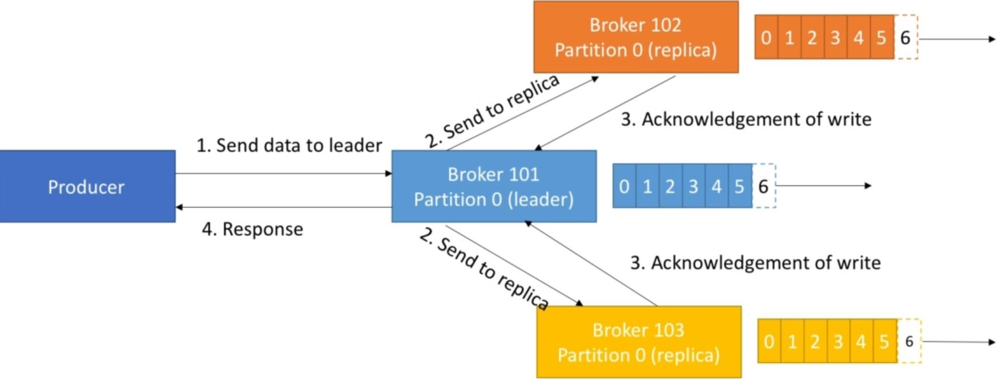		
	- **Necessary setting** to prevent data loss. 
	- `acks=all` must be used in conjuction with `min.insync.replicas`, which can be set at the `broker` or `topic` level(e.g. override).
	- most '*common setting*' is `min.insync.replicas = 2`, i.e. at least 2 brokers that are **ISR** (including leader) must **respond** that they **received** the **data**, otherwise an **error** message occurs.
	- if we use `replication.factor=3`, `min.insync.replicas=2` and `acks=all`, we can only tolerate **ONE broker** going **down**, otherwise the **producer** will **receive** an **exception** on send.
	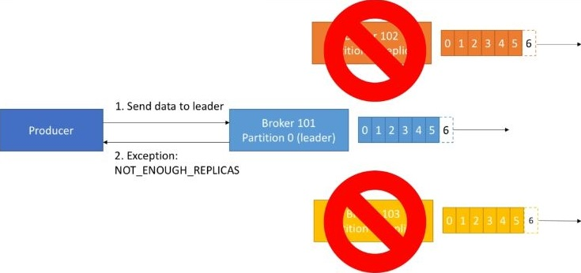		
	
> Note that the `replication.factor` is the number of **replicas** per partition, while `min.insync.replicas` is how many **responses** or `acks` are **required** per **In-Sync replica** or **per broker** to consider that the data is secured against any potential losses. e.g. `min.insync.replicas=2`: **TWO brokers** `ack` is considered to be reliable enough and shield us from any potential data losses even though we could have `replication.factor > 2` (i.e. number of **ISR**). 

**Producers retries**
---- 
- In case of **transient failure**, **developers** are expected to **handle exceptions** (e.g. `NotEnoughReplicasException`), otherwise the **data** will be **lost** 
- There is a `retries` setting: **default** is `0`, but we can **increase** to a **high number**, e.g. `Integer.MAX_VALUE` which gives an **indefinite retry** until it **suceeds**.
- In case of **retries**, by default there is a **chance** that **messages** will be **sent** out of **order**(*if a batch has failed to be sent, messages get requeued!*)
- If we **rely** on **key-based ordering**, that can be an **issue**.
- To control this **behaviour**, we can **sent** the **setting** while **controls** how many **producers request** can be made in **parallel** : `max.in.flight.requests.per.connection`
	- **default**: `5`
	- We set it to **ONE**, if we need to **ensure ordering** (may impact `throughput`)
- In **Kafka >=1.0.0**, there's a **better solution**!.

**Producers idempotence**
---- 
in Kafka >= 0.11, we can define an **idempotent producer** which won't introduce a **duplicate** when **network errors** occurs.
- **Idempotent producers** guarantee a stable and safe pipeline and doesn't add a big **overhead**.
- We need to set `producerProps.put("enable.idempotence",true)` and we get by **default** :  
	- For **Kafka >= 0.11**: **retries** are set to `Integer.MAX_VALUE = 2^31-1=2174483647` 
	- For **Kafka >= 0.11 & < 1.1** `max.in.flight.requests.per.connection=1`, **or** `max.in.flight.requests.per.connection=5` for **Kafka >= 1.1** which offers a **higher performance**.
	- `acks=all` included as well.
	

**Safe prooducer summary**

**Kafka < 0.11**:
- `acks=all`  (producer level) : ensures data is properly replicated before an `acks` is received
- `min.insync.replicas=2` (broker/topic level): ensures two broker in ISR at least have the data after an `ack`  
- `retries=MAX_INT` (producer level): Ensures transient errors are retries indefinitely.
- `max.in.flight.requests.per.connection=1` (producer level) : Ensures only one request is tried at any time, preventing message re-ordering in case of retries.

Kafka >= 0.11 :
- `enable.idempotence=true` (producer level) + `min.insync.replicas=2` (broker/topic level) : 
	- Implies  `acks=all`, `retries=MAX_INT`, `max.in.flight.requests.per.connection=5`(default)
	- keeps ordering guarantees and improving performance!

> Running a **safe producer** might impact **throughput** and **latency**, always test case by case. see [TwitterProducer.java](/Kafka/simple-Java/kafka-twitter-producer/src/main/java/twitter/producer/TwitterProducer.java).


**Messages compression**
---- 
- **Producer** send often **text-based messages** : json/xml/text based, in such a case it's important to **apply** **compression**.
- `compression.type` can be `none` (**default**),`gzip`,`lz4`,`snappy` (made by google) 
- **compression** is more **effective** when the sent **batch** is **bigger** in **size**.
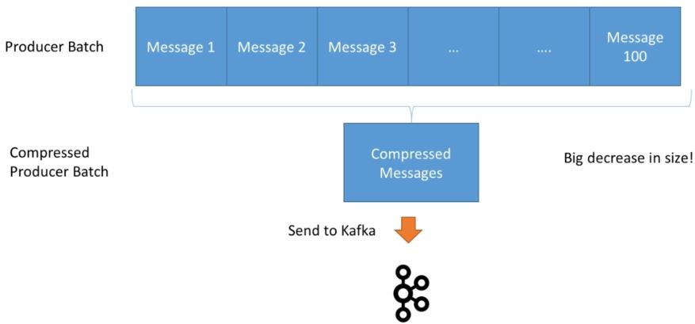	

- **Advantages of batch compression** :
	- Much **smaller producer request** size (compression ratio up to 4x)
	- faster to **transfer data** over the network (i.e. less latency)
	- better **throughput**
	- better **disk utilisation** in Kafka(stored messages on disk are smaller)
	
- **Disadvantages**
	- Producers must commit some **CPU cycles** to **compression**
	- Consumers must commit some **CPU cycles** to **decompression**

> consider testing `snappy` or `lz4` for optimal **speed/compression ratio**.
> consider tweaking `linger.ms` and `batch.size` to have a **bigger batches** and therefore more **compression** and **higher throughput** explain next.

[Benchmarks](https://blog.cloudflare.com/squeezing-the-firehose/)


**Linger.ms and batch.size**
----
- **Kafka** tries to send **records** as soon as possible by **default**:
	- It will have up to **5 requests in flight** (i.e. 5 **individual messages** sent **simultaneously**)
	- If more **messages** have to **be sent** while others are **in flight**, **Kafka** is smart enough to **start** **balancing** them while it **waits to send them all at once**.
	- **producer Smart batching** allows **Kafka** to increase **thoughput** while maintaining very **low latency**(e.g. **producer** won't do 1000 requests it will batch them).
	- **Batches** have higher **compression ratio** so better **efficiency** (i.e. **producer** send one **batch** instead of several request, so less **overhead**) 
	- So how can we **control** the **balancing mechanism**?
	
- `linger.ms` : is number of `milliseconds` a **producer** is willing to wait before sending the **batch** out (`default` is 0),e.g. setting it to `linger.ms=5` we increase for instance the chances of **messages** to be sent in a **batch**.
- A small **delay** of `linger.ms` allows us to increase **thoughput**, **compression** and **efficiency** of the **producers**. 

- If `batch.size` is reached before `linger.ms` period elapsed, it will send antway!, `batch.size` is the Max number of bytes that will be included in a batch (default is 16KB).
- Setting the **batch size** to **32KB/64KB** increases the **compression**, **throughput** and **efficiency** of **requests**. 
- **Message** that is bigger that the **batch size** **won't** be **batched**.
- **batch size** is allocated by **partition**, setting it to a **higher number** might lead to a **waste of memory**. Use Kafka Producer metrics to monitor the  **batch size** average. 

> by introducing a small delay (`linger.ms`) in kafka we manage to get less requests and more throughput. 


**Producer Default Partitions and Key Hashing - Theory**
----
- **keys** are **hashed** uing `murmur2` algorithms.
- It's most likely preferred never **override** the default partitioner, but it is possible to do so (`partitioner.class`) and provide our **own partitioner class** .
- The target formula: `targetPartition=Utils.abs(Utils.murmur2(record.key()))%numberOfPartions`, i.e. The same key will go to the same partition, but if we added/remove a **partition to a topic**, it will completely alter the formula and the **keys-partition** association with it.

**max.block.ms and buffer.memory**
	
**Exception** occurs when the **producer** produces a way **faster** than the **broker can take**, the records are buffered into memory:
- **broker** can not **ingest data** **fast enough** and get **overloaded**. 
- Or, we haven't **sized** the **broker** correctly, 
- Or, there's a **peak of usage** in the application.

- **buffer.memory** =33554432 (32MB) is the size of the `.send` buffer, which will fill over time and fill back down when the **throughput** to the **broker increase**.
- if the **buffer is full** (32MB), then the `.send` will **start to block**

- `max.block.ms=60000` (60 seconds) is the time the `.send` will block until **throwing an exception**. **Exceptions** are thrown when : 
	- The **producer** has **filled** up its **buffer**
	- The **broker** is not **accepting any new data**
	- **60 seconds** has **elapsed**.
	
- An **exception** usually means the **broker is down** or **overloaded** as it cannot respond to requests.


**Consumer Poll Behaviour**
----
**Kafka Consumers** have a `poll` model, while many other messaging bus in entreprise have a **push** model. 
This allows **consumers** to control where in the **log** they want to **consume**, **how fast** and give them the **ablity** to **replay** the **events**.
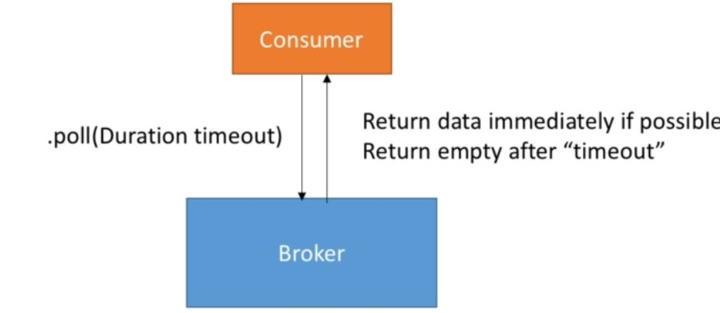	

To control the Consumer Poll Behaviour we could rely on the following :
- **Fetch.min.bytes** (by default is `1` ):
	- **control** how much **data** do we want to **pull** at **least** on each **request**. 
	- helps improving **throughput** and decreasing the **request number** ( e.g. I don't want Kafka to give me anything unless I got a 100 kilobytes).
	- at the cost of the **Latency**

- **Max.poll.records** (by default is `500`)
	- Controls how many **records** to **receive** per **poll request**.
	- Increase if your **messages** are **very small** and have a **log** of **available RAM**.
	- Good to **monitor** how many **records** are **polled per request**.
	
- **max.partitions.fetch.bytes** (default 1MB):
	- maximum date returned by the broker per partition
	- if you read from 100 partitions, you'll need a lot of memory (RAM)
- **Fetch.max.bytes** (default 50MB):
	- Maximum data returned for each **fetch request** (covers **multiple partitions**)
	- The **consumer** performs **multiple fetches** in **parallel**
	
> Change these setting only if the consumer maxes out on throughput already!


**Consumer Offsets strategies**
----

There **two** most common **patterns for committing offsets** in a **consumer** app:
-  `enable.auto.commit=true` & **synchronous processing** of **batches** (easy : used by default):
	- with `auto-commit`, **offsets** will be commited **automatically** at **regular interval** (`auto.commit.interval.ms=5000` by default) every time a call to `.poll()` is made.
	- if we don't use the **synchronous processing**, we will be in `at-most-once` **behaviour** because **offsets** will be **committed** **before data** is **processed**. 
	
-  `enable.auto.commit=false` & **manual commit** of **offsets** (medium): 
	- `enable.auto.commit=false` with synchronous processing of batches.
	-  we control when **we commit offsets** and what's the **condition for committing** them. (e.g. *accumulation records into a buffer and then flushing he buffer to a database + committinfg offsets*)
	
**Consumer Offsets Reset Behaviour**
----
	
a **consumer** is expected ot read from a **log continuously**, but if an **app** has a **bug**, the **consumer** can be down 

	 

If kafka has a **retention of 7 days**, and the **consumer is down** for more than **7 days**, the **offsets** are `invalid`. 

The **behaviour for the consumer** is to then use:

- `auto.offset.reset=latest`: will **read** from the **end of the log**
- `auto.offset.reset=earliest`: will **read** from the **start of the log**
- `auto.offset.reset=none`: will throw an **exception** (prompt us for manual intervention)

Additionally, **consumer offsets can be lost**:

- If a **consumer** hasn't **read** new data in **ONE day** (Kafka <2.0)
- If a **consumer** hasn't **read** new **data in 7 days** (Kafka >=2.0)

This can be **controlled** by the **broker setting** `offset.retention.minutes`


**Replaying data for consumers**
----

To replay data for a **consumer group**:

- Take all the **consumers** from a **specific group**
- Use `Kafka-consumer-groups` **command** to set **offset** to what we want
- **Restart consumers**

**In Summary**:

- Set **proper data retention period** & **offset retention period**
- Ensure the **auto offset reset** behaviour is the one we expect/want
- Use **replay** capability in case of **unexpected behaviour**.


**Consumer Internal Threads**
----
how does a **consumer group work**? How does **everything get coordinated**?
Each **consumer** is going to **poll Kafka** (i.e `poll threads process`), and each **consumer** is also going to talk to a **consumer coordinator** and send **heartbeats**.


These two **separate threads** allow to check if the **consumer are alive or dead**:

- The **poll of the brokers** :
- the **heartbeats** : allows the brokers to check whether or not the consumers are alive or not.

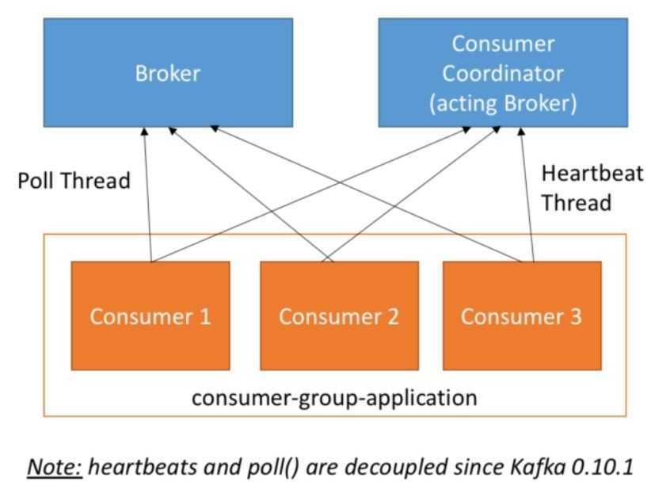	 

- When a consumer **stops beating**, the **consumer's coordinator** (which is an **active broker**) step in and do a **rebalance**. 
- to make sure that these two **threads are correctly** functioning, it is encouraged to **process data fast** and **poll often**, otherwise we get a lot of **rebalances**.


- **Consumers in a group** talk to a **consumer groups coordinator** 
- To detect** consumers that are down**, there is a `heartbeat` mechanism and a `poll` mechanism
- To avoid **issues**, **consumers are encouraged** to process **data fast** and **poll often**.   


`session.timeout.ms` (default 10 seconds) :
- **Heartbeats** are **sent periodically** to the **broker**
- If **no heartbeat** is sent during that period, the **consumer** is considered **dead**
- Set even **lower** to **faster consumer rebalances**

`Heartbeats.internal.ms` (default 3 seconds) :
- how often to send a **heartbeats**
- Usually set to **1/3rd** if `session.timeout.ms`

> this mechanism is used to **detect** a **consumer application being down**.


**Consumer Poll Thread**
----

`max.poll.internal.ms` (default 5 minutes) :
- **Maximum amount** of **time** between two `.poll()` **calls** before declaring the **consumer dead**
- This particulary **relevant for Big data** frameworks like `Spark` in case the **processing** takes time.

> This **mechanism** is used to **detect** a **data processing issue** with **consumer**.


# Twitter --> KAFKA --> Elastic search
----

**step 1** : We need to create a **Twitter [developer account](https://developer.twitter.com/en)** to get credentials for Twitter.

**disclaimer** :
> I intend to use Twitter feed to get real-time data streams into an application that will put data into Kafka (local machine), I solemnly use this for learning purposes. The data will end up in ElasticSearch at the end and this is just for POC support and concept. Purposes: no commercial obligation will result out of this, and I won't have any users besides just myself. twitter data will not be displayed, and we will only extract tweets on low volume terms. I will make the information available to a government entity if deem necessary.
and `submit your application`.

> add application description: this application will read streams of tweets in real time and put them into Kafka.So we need to get keys and tokens to have a consumer API key and API secret key.we have to create an access token and access token secrets.


**step two** :  head to [Hosebird Client (hbc) - Github twitter, java](https://github.com/twitter/hbc).
It's a **java client** which consumes **twitter's streaming API**, we need also to copy from there the **Twitter dependency**.


the bottom line is, we need to **create** **[twitter client](https://github.com/twitter/hbc)** and **Kafka producer**.
see [TwitterProducer.java](/Kafka/simple-Java/kafka-twitter-producer/src/main/java/twitter/producer/TwitterProducer.java).


For elastic search we use [bonsai.io](bonsai.io), we need to create a **cluster** and an **index** through the [bonsai.io](bonsai.io) console.

for Java comsumer see [ElasticSearchConsumer.java](/Kafka/simple-Java/kafka-consumer-elasticsearch/src/main/java/elasticsearch/ElasticSearchConsumer.java).


# Kafka Connect and Stream
----
[**Kafka Connect**](https://jcustenborder.github.io/kafka-connect-documentation/installation.html): simplify and improve getting **data** **in** and **out** of **kafka**, [see supported Connectors](https://docs.confluent.io/current/connect/managing/connectors.html) :

- **Source connectors** allow us **get data** from Common Data sources (i.e. `Databases`, `twitters`, `elastic search db`, ...). 
- **Sink connectors** allows us to **publish data** into Common Data sources (i.e. Databases, twitters, elastic search db, ...). 
- Allows **re-usable code**, it's **config based**, no **programming skill** is required (i.e. `jar libraries` and `properties` file config)
- It Could be part of **ETL pipeline**
- **Scaling** (made easy) from small pipelines to company-wide pipeline

**Kafka Stream** : simplify **transforming data** **within Kafka** without relying on **external library**. [see full example](/Kafka/simple-Java/kafka-streams-tweets-filter/src/main/java/kafka/stream/StreamsFilterTweets.java).


**Four Kafka user cases** : 
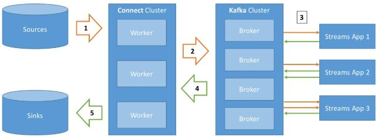	 


- **Source** => **Kafka** : instead of *Producer API*, use **Kafka Connect Store**
- **Kafka** => **Kafka** : instead of *Consumer, Producer API*, use **Kafka Streams**
- **Kafka** => **Sink** : instead of *Consumer API*, use **Kafka Connect Sink**
- **Kafka** => **App** : **Consumer API**		

> search for a [kafka connector](https://www.confluent.io/hub/), [download](https://github.com/jcustenborder/kafka-connect-twitter/releases)


**Example on how to use Connector for twitter**:
- [download tar file](https://github.com/jcustenborder/kafka-connect-twitter/releases) and extract the jar's into `c:\twitter-connector` 
- copy the folder `c:\[kafka_x.xx-x.x.x]\config\connect-standalone.properties` into `c:\twitter-connector` and change the line `plugin.path=plugins` and set `twitter.properties` file (e.g. credentials, topics, ...).
- run the command `connect-standalone.bat connect-standalone.properties`


**Schema registry**
----
**Kafka** takes **bytes** as **input** and **publish** them, i.e. **no data verification** is involved. If a **producer** send **bad data**, **fields** get **renamed** or **data format** changes the **consumers** will **break!**. 

	

Hence, the need for data to be self describable and evolve without breaking **downstream consumers** and this could be **achieved** through **schema registry**:

- **Schema registry** is a separate **component**. 
- **Producers** and **consumers** talk to **schema registry** to validate the data structure.
- **Schema registry**: **checks**, **validate** and **reject bad data**.
- A **common data format** must be **agreed** upon, this should  **support schemas**, **evolution** and must be **lightweight**.
- **Kafka** provides out of the box **`Confluent schema registry`** and `appache Avro` as the **data format**.


**Confluent schema registry**
---
- **Store** and **retrieve** **schemas** for **Producers/Consumers**
- **Enforce** **Backward/Forward/full compatibility** on **topics**
- **Decrease** the **size of the payload** of **data** sent to **kafka**.
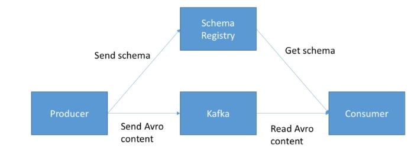

**However a few gotchas!**
	
- we have to make it **highly available**.
- we need to **change** partially  the **code** for **consumers** and **producers**.
- `Apache avro` is **reliable** but there is a **learning curve**.
- **Confluent schema registry** is open source and free.
- It takes **time** to set up.
 
 
**Real World business Cases (Big Data  Fast Data)**
----

**Video analystics Architecture**
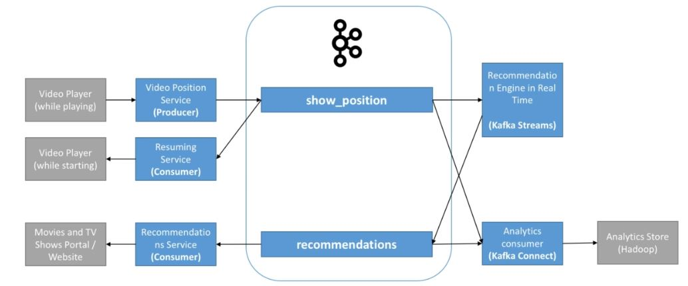

**CQRS Social media Architecture**


**Bank account realtime monitoring**
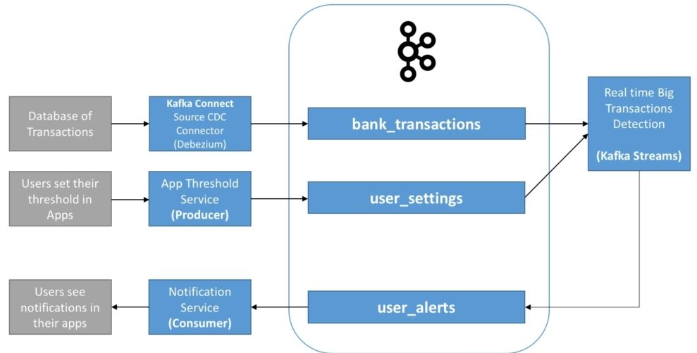

**IOT - GetTaxi business case**
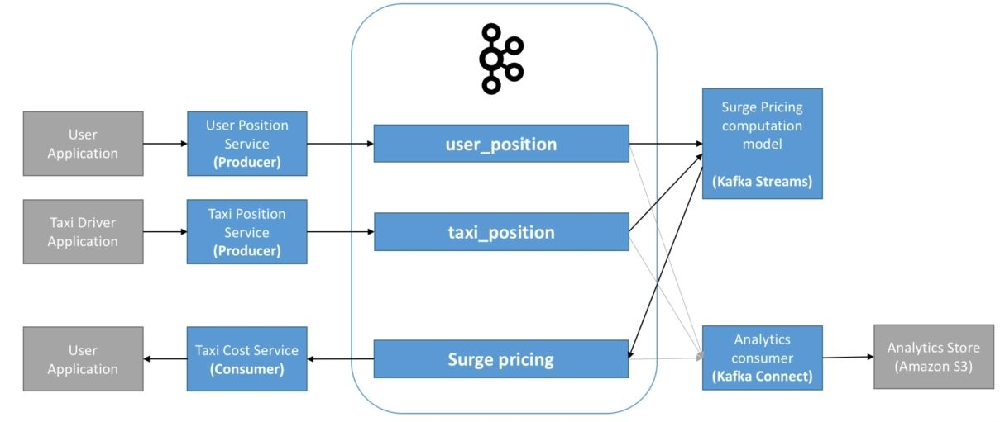


**Big data ingestion business case**
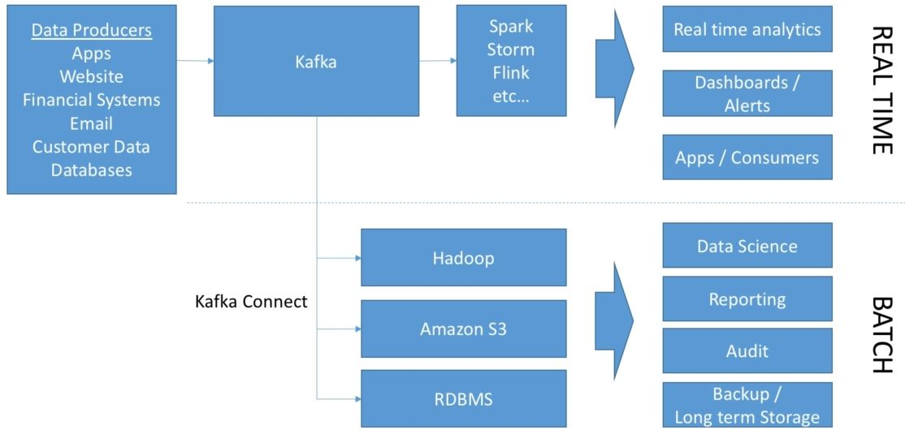

**Logging and Metrics Aggregation**
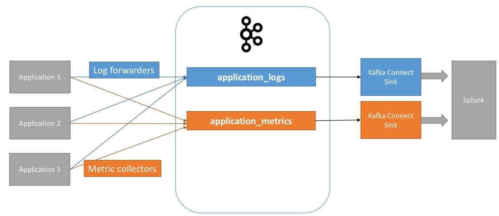


# Docker container & running Kafka on AWS cloud EC2

To run docker local stack on single or multi-broker kafka cluster, please check out [github](https://github.com/simplesteph/kafka-stack-docker-compose)


**To run kafka as a cluster in EC2**
- Use a linux AMI with a free tier
- Open ssh & Kafka ports with the Security group.
- Install Java 8 
- Download kafka on EC2 instance
- `export KAFKA_HEAP_OPTS="-Xmx256M -Xmx128M"` because we will be  on a small machine, we need to export Kafka heap options.
- go and edit `conf/server.properties`, add AWS_PUBLIC_IP to `advertised.listeners=PLAINTEXT://[AWS_PUBLIC_IP]:9092` 
- start zooKeeper in daemon mode `bin/zooKeeper-server-start.sh -daemon config/zookeeper.properties`
- start kafka in daemon mode `bin/kafka-server-start.sh -daemon config/server.properties`
- create a producer from the local machine `kafka-console-producer --broker-list [AWS_PUBLIC_IP]:9092 --topic mytopic` or `kafka-console-producer --boostrap-server [AWS_PUBLIC_IP]:9092 --topic mytopic` in the cluster and start typing messages.


